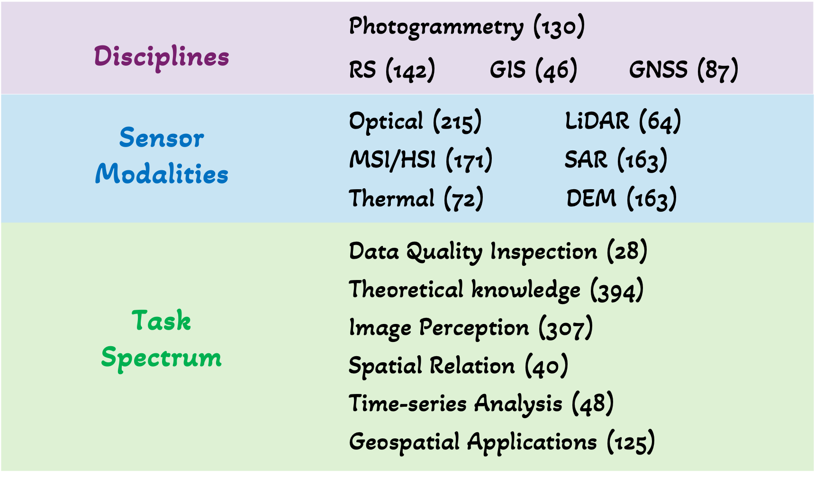
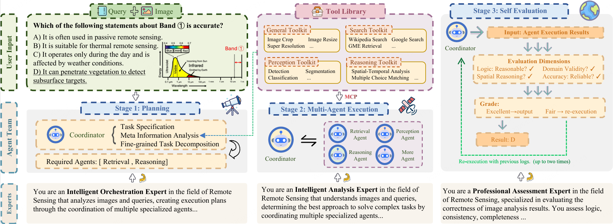
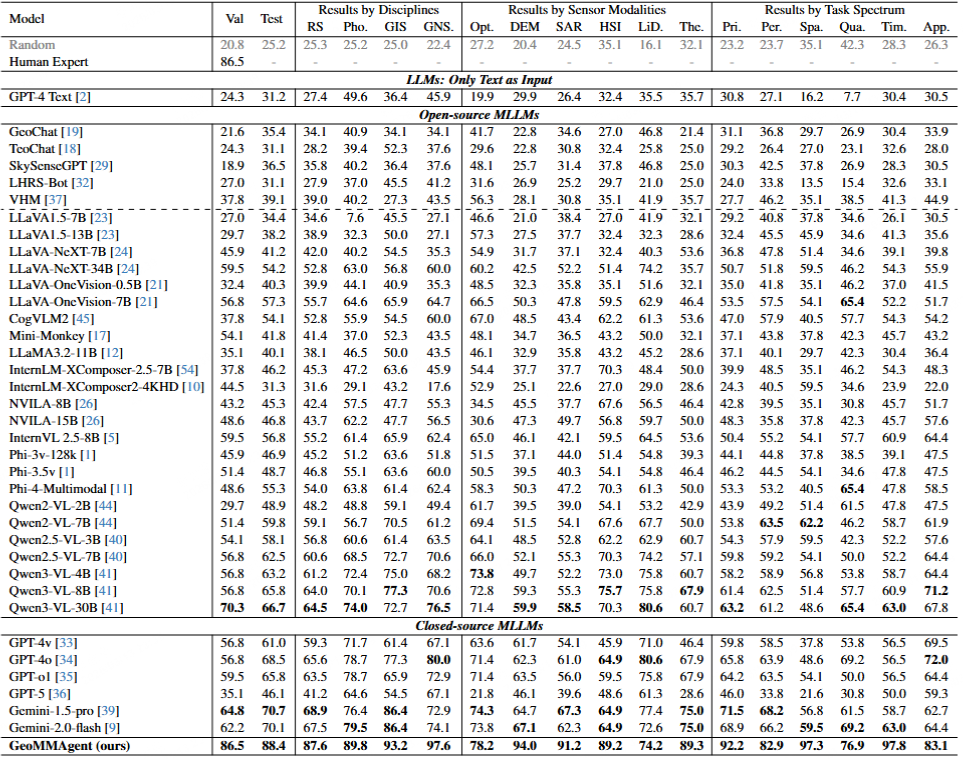

<p align="center">
  <h1 align="center">🛰️ GeoMMBench & GeoMMAgent: A Multimodal Benchmark and Multi-Agent Framework for Geoscience Remote Sensing</h1>
</p>

<p align="center">
  <a href="https://arxiv.org/abs/XXXX.XXXXX">📄 Paper</a> |
  <a href="https://huggingface.co/datasets/GeoMM/GeoMMBench">🤗 Dataset</a> |
  <a href="https://geomm.github.io">🌐 Project Page</a> |
  <a href="https://huggingface.co/spaces/GeoMM/GeoMMAgent">🤗 Demo</a>
</p>

<p align="center">
  <!-- TODO: replace with actual badge URLs -->
  
  
  
</p>

---

## News

- `2026/03`: 🎉 GeoMMBench & GeoMMAgent accepted by **CVPR 2026**!
- `2026/03`: We release the GeoMMBench dataset on [🤗 Hugging Face](https://huggingface.co/datasets/GeoMM/GeoMMBench), containing 1,053 expert-level multiple-choice questions.
- `2026/03`: Code for GeoMMAgent (coordinator, exec_agents, toolkit) is publicly available.

---

## Introduction

**GeoMMBench** is a comprehensive multimodal question-answering benchmark for geoscience and remote sensing (RS), featuring **1,053 expert-level, image-based multiple-choice questions** covering:

- 🌍 **4 disciplines**: Remote Sensing, Photogrammetry, GIS, GNSS
- 📡 **6 sensor modalities**: Optical, SAR, Hyperspectral, LiDAR, DEM, Thermal
- 🔬 **Diverse task spectrums**: Scene classification, object detection, change detection, spectral analysis, spatial reasoning, and more

<!-- TODO: replace with actual benchmark overview figure -->


**GeoMMAgent** is a multi-agent framework following a **plan–execute–evaluate** paradigm, integrating four specialized toolkits and five agent roles:

| Toolkit | Capability |
|---------|-----------|
| 🔧 General Toolkit | Format conversion, patch tiling & merging, filtering, cropping, scaling, super-resolution, area counting, box counting |
| 🔍 Knowledge Toolkit | Web search (Google, Wikipedia), GME multimodal retrieval |
| 👁️ Perception Toolkit | Scene classification (YOLO11/Million-AID), object detection (YOLO11/DOTA-v2), semantic segmentation (DeepLabv3+/LoveDA) |
| 🧠 Reasoning Toolkit | Multi-step inference, spatial-temporal analysis, multiple-choice matching |

| Agent | Role |
|-------|------|
| Coordinate Agent | Task planning, decomposition, and multi-agent orchestration |
| Perception Agent | Extract visual evidence via scene classification, object detection, and segmentation |
| Knowledge Agent | Retrieve and synthesize external factual information |
| Reasoning Agent | Multi-step logical inference integrating perception and knowledge outputs |
| Self-Evaluation Agent | Assess answer correctness, logic consistency, and evidence grounding |

<!-- TODO: replace with actual agent framework figure -->


---

## Benchmark Results

GeoMMBench evaluates **36+ vision-language models** under zero-shot conditions. GeoMMAgent achieves state-of-the-art performance.

<!-- TODO: replace with actual results table figure -->


See the [paper](https://arxiv.org/abs/XXXX.XXXXX) for full results and analysis.

---

## GeoMMAgent Architecture

The agent follows a modular, plug-in design:

```
coordinator/
  ├── planner.py            ← Task specification & decomposition
  ├── coordinator.py        ← Workforce orchestration & execution
  └── prompts.py            ← Planning & coordination prompts

exec_agents/
  ├── general/              ← Preprocessing & postprocessing (GeneralAgent)
  ├── perception/           ← Scene classification, detection, segmentation
  ├── knowledge/            ← Web search + GME multimodal retrieval
  ├── reasoning/            ← Multi-step inference & answer matching
  └── evaluation/           ← Self-evaluation & quality assessment

toolkit/
  ├── general.py            ← General preprocessing/postprocessing tools
  ├── perception.py         ← RS perception tools (YOLO, DeepLabv3+)
  ├── classification_toolkit.py  ← YOLO scene classification implementation
  ├── detection_toolkit.py  ← YOLO object detection implementation
  ├── knowledge.py          ← GME multimodal retrieval
  ├── reasoning.py          ← Spatial-temporal analysis & option matching
  ├── super_resolution.py   ← Super-resolution model interface
  └── data_loader.py        ← GeoMMBench parquet data loader
```

<!-- TODO: replace with actual code architecture figure -->


---

## Quick Start

### Installation

```bash
git clone https://github.com/GeoMM/GeoMMAgent.git
cd GeoMMAgent
pip install camel-ai[all]
```

### Environment Setup

```bash
cp .env_template .env
```

Edit `.env` and fill in the required API keys. At minimum you need:

- **`QWEN_API_KEY`**: Required for the default model (Qwen-Max). Get it from [Alibaba Cloud Model Studio](https://help.aliyun.com/zh/model-studio/developer-reference/get-api-key).
- **`GOOGLE_API_KEY`** + **`SEARCH_ENGINE_ID`**: Required for the Knowledge Toolkit's web search capability.

### Run GeoMMAgent

```bash
# Single-query demo (plan → execute → evaluate)
python examples/run_geomm.py "这张遥感图像中有几架飞机？"

# Benchmark evaluation on GeoMMBench validation set
python examples/run_geomm.py --bench /path/to/validation.parquet

# Benchmark with limited samples (for quick testing)
python examples/run_geomm.py --bench /path/to/validation.parquet --limit 5
```

### Model Configuration

The default model is `qwen-max` (Qwen-VL-Max, supporting image+text input). To use a different model, modify `create_model()` in `examples/run_geomm.py`:

```python
def create_model():
    return ModelFactory.create(
        model_platform=ModelPlatformType.OPENAI,
        model_type="gpt-4o",
        model_config_dict={"temperature": 0},
    )
```

See [CAMEL Model Documentation](https://docs.camel-ai.org/key_modules/models.html) for all supported platforms and model types.

---

## Dataset

GeoMMBench is available on [🤗 Hugging Face](https://huggingface.co/datasets/GeoMM/GeoMMBench):

```python
from datasets import load_dataset
ds = load_dataset("GeoMM/GeoMMBench")
```

| Split | Questions |
|-------|-----------|
| val   | 37        |
| test  | 1,016     |
| **total** | **1,053** |

Each sample contains: `image`, `question`, `options (A/B/C/D)`, `answer`, `discipline`, `sensor_modality`, `task_spectrum`.

---

## Model Weights

| Model | Usage | Download |
|-------|-------|----------|
| YOLO11-cls (Million-AID) | Scene Classification | [🤗 HuggingFace](https://huggingface.co/GeoMM/yolo11-cls-millionaid) |
| YOLO11-obb (DOTA-v2) | Object Detection | [🤗 HuggingFace](https://huggingface.co/GeoMM/yolo11-obb-dotav2) |
| DeepLabv3+ (LoveDA) | Semantic Segmentation | [🤗 HuggingFace](https://huggingface.co/GeoMM/deeplabv3plus-loveda) |

After downloading, place the weights under a `weights/` directory or update the model paths in `toolkit/classification_toolkit.py` and `toolkit/detection_toolkit.py`.

---

## Extending GeoMMAgent

GeoMMAgent is designed as a **training-free, extensible** framework. New tools can be added without model fine-tuning or architectural changes:

1. **Add a new tool** in `toolkit/` following the existing pattern (function with docstring → `FunctionTool` wrapper).
2. **Create an agent** in `exec_agents/` that binds the tool (inherit `BaseExecAgent`, override `get_tools()`).
3. **Register the agent** in `examples/run_geomm.py` via `coord.register_workers()`.

---

## Contact

<!-- TODO: fill in actual contact information -->
- Xiao et al.: [email@institution.edu]

---

## License

The GeoMMBench dataset is distributed under the [CC BY 4.0 License](https://creativecommons.org/licenses/by/4.0/).
The code is released under the [Apache License 2.0](https://www.apache.org/licenses/LICENSE-2.0).

---

## Citation

```bibtex
@inproceedings{xiao2026geomm,
  title={GeoMMBench and GeoMMAgent: Toward Expert-Level Multimodal Intelligence in Geoscience and Remote Sensing},
  author={Xiao, Aoran and Cheng, Shihao and Xu, Yonghao and Ren, Yexian and Chen, Hongruixuan and Yokoya, Naoto},
  booktitle={Proceedings of the IEEE/CVF Conference on Computer Vision and Pattern Recognition (CVPR)},
  year={2026}
}
```
